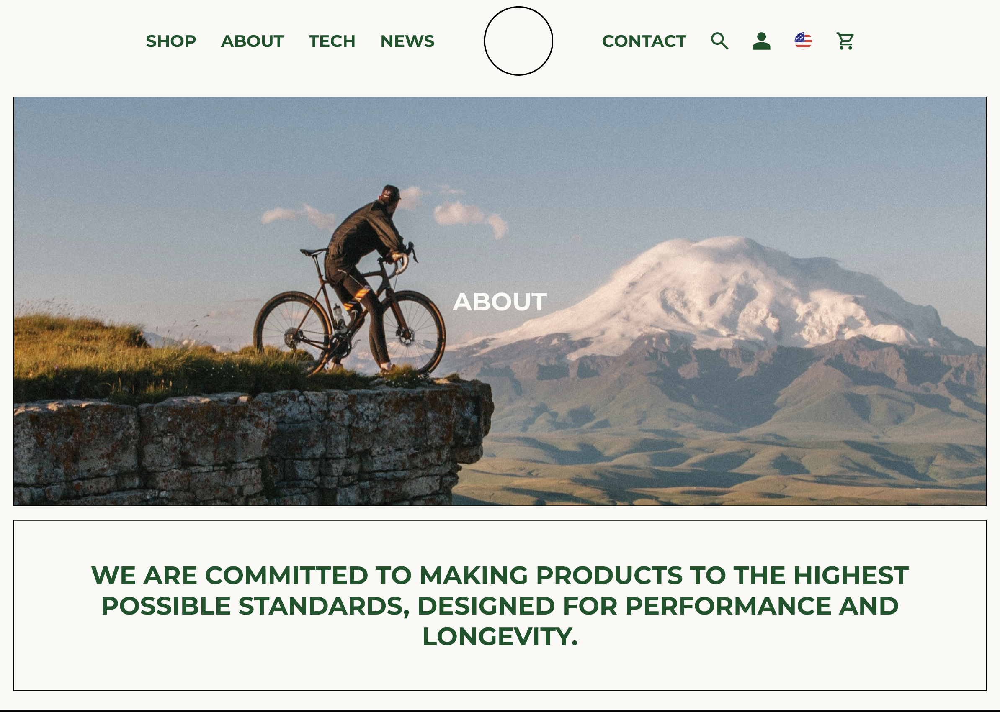

# Ophroad (In progress)
----
[Go]()

Mountain bike store specializing in rides that can escape and evade an angry momma grizzly :bear: in the woods.

# Wireframes and Planning
----
[Figma](https://www.figma.com/file/x7htRA0s5D8XVchBncYEHU/Ophroad?type=design&node-id=0%3A1&mode=design&t=ZrbQ4FcN1Nj5Xi0p-1)

# Screenshots
----

[News page](images/news-page.png)

[Bike design](images/bike-design.png)

[Footer](images/footer.png)

# Technology
----

